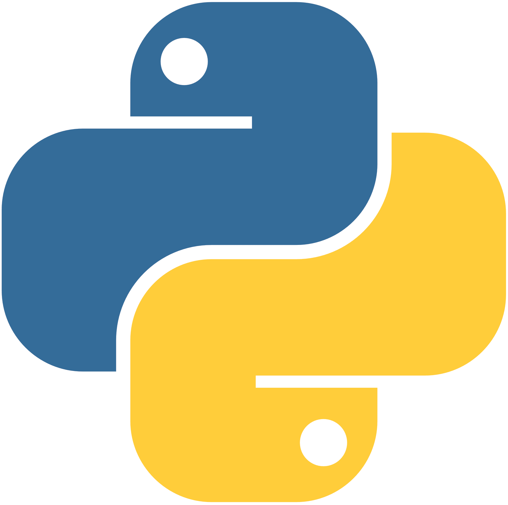

## Hi there 👋 This is Ray HU! 

> **[CITY]** Fuzhou, China *(Date of last update: 2026-01-21)*
>
> **[MOTTO]** Action precedes motivation.

### **Tools &  Status** 

<code></code><code></code><code></code><code></code><code></code><code></code><code></code><code></code>

<table cellspacing="0" cellpadding="0">
  <tr align="center" valign="middle">
    <td></td>
    <td></td>
  </tr>
</table>

### **About Me**

- 😀 I'm Ray HU, and you can just call me **Ray**;
- 📰 My *Myers–Briggs Type Indicator* personality type is **ENFJ / INFJ**;
- 💻 I'm fluent in Python, C/C++ and Verilog;
- 🛠 I'm interested in Deep Learning, Computer Vision and LLM;
- 🎸 I'm a beginner in acoustic/classical guitar,and a fan of all kinds of music;
- 📖 I'm a native Mandarin speaker, proficient in English and familiar with French;

### **Time Line**

- 🏫 [2019.09 ~ 2024.07] Tongji University *(Shanghai, China)*
- 🏢 [2022.07 ~ 2022.09] Jimu Kankan Information Technology Co., Ltd *(Shanxi, China)*
- 🏫 [2022.09 ~ 2023.07] Intensive French Language Training Class - Tongji University *(Shanghai, China)*
- 🏫 [2024.08 ~ 2025.11] Imperial College London *(London, United Kingdom)*
- 🏢 [2025.01 ~ 2025.10] Swanley Auction Ltd *(London, United Kingdom)*

 

**P.S. Feel free to contact me via [rayhuc@163.com](mailto:rayhuc@163.com). 但请保持礼貌，谢谢。**

**P.S. It's okay to use this as a template, but please ensure that all the links in this file are changed accordingly.**

